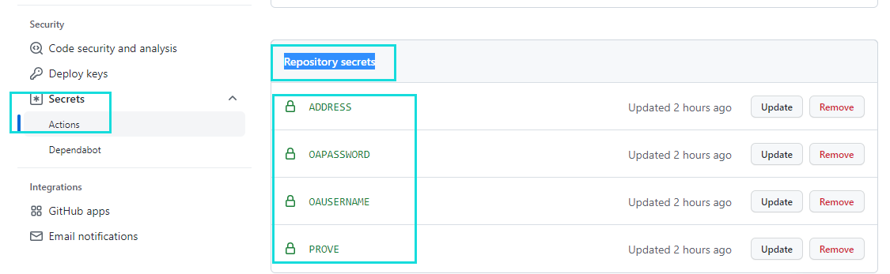
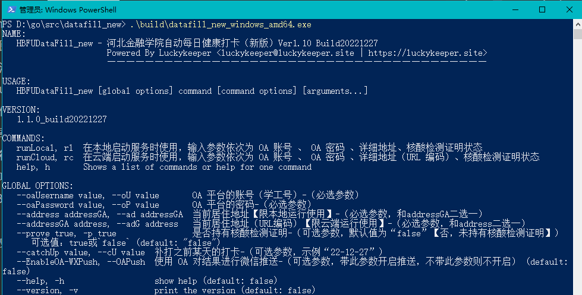
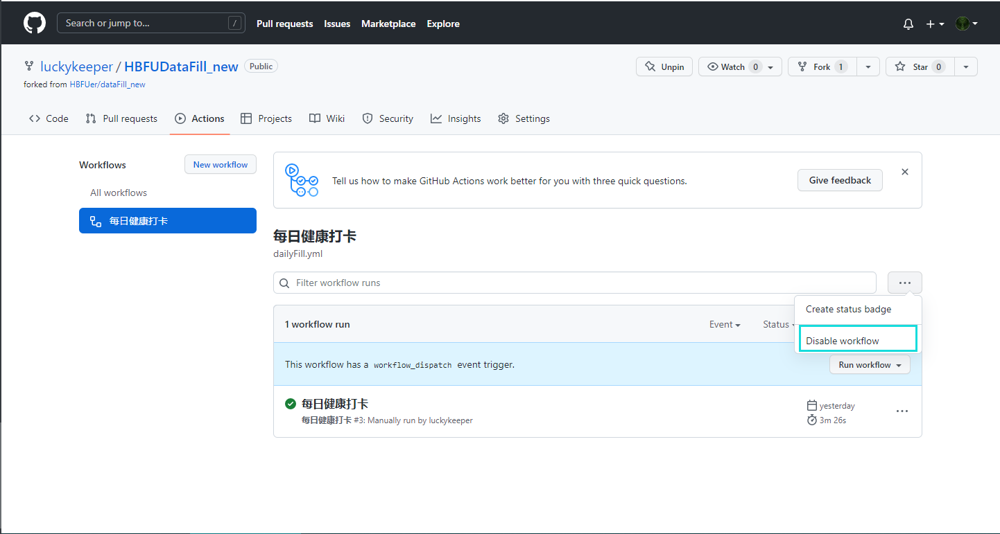

# dataFill_new

**这是 1.1.0 （不含）之前版本的旧文档，最新版本文档请[点这里](./README.md)**

<details>   <summary>【2022/10/19-置顶】近期GitHub Action 无法完成打卡的情况说明</summary>   <p>近期（2022/10/19开始）发现 GitHub Action 运行方式在 POST QueryListPage 的时候会出现超时情况，这可能是 GitHub 从国外线路访问国内的问题或是 OA 对境外访问进行了阻断，目前的解决方式有：</p><p><li>使用本地版结合定时运行实现自动打卡</li><li>使用境内的 CI/CD 服务（作者目前选择的是这个方式，自建 Gitea + drone 来解决这个问题，你可以参考项目根目录下 .drone.yml 文件完成 pipeline 的设置）</li></br>据观察，此现象目前已缓解，仍然推荐优先使用 Github Action ，以上两种方式可作为备用选项</p></details>

河北金融学院每日自动健康打卡（新版）

适配了最新微信小程序打卡方式，适用于自 2022-06-22 后的每日健康打卡

> 程序作者的每日自动打卡程序的运行情况： [](https://cicd.luckykeeper.site:44443/LuckySoft/dataFill_new)

## 运行截图

如果程序顺利运行，将会在运行中截取两张图片放在 `./Screenshots` 文件夹下，分别是：

（tips：点击箭头可以展开查看图片）

<details>   <summary>oaLoginPage.png OA 登录页截图</summary>   <p></p>    <span>OA 登录页截图</span></details>

<details>   <summary>oaLogined.png 健康打卡页截图（打卡前截图）</summary>   <p></p>    <span>健康打卡页截图（打卡前截图）</span></details>

运行结果会是以下情况之一：

<details>   <summary>当日未打卡，完成打卡</summary>   <p></p></details>

<details>   <summary>当日打卡未发放（一般是没有到中午12点）</summary>   <p></p></details>

<details>   <summary>当日打卡已经完成，不需要重复提交</summary>   <p></p></details>

## 运行方法

我们提供了 `GitHub Action`（推荐） 和 `单文件` 两种运行方式

### GitHub Action（推荐）

> GitHub Action 是 GitHub （2018年被微软收购）提供的服务，可以利用微软的服务器运行自己的程序，GitHub 为每个个人用户提供了每月 3000 分钟的免费运行额度，在此感谢 GitHub 和微软！

> 使用这种方式，你在设定好之后每日即可自动打卡，不需要自己准备设备，不需要人工干预！

> **请务必在理解单文件运行方式的前提下使用 GitHub Action** 

1. 首先你需要拥有一个 GitHub 账号，如果没有，请点击[这里](https://github.com/)然后点击右上角的 `Sign up` 注册一个，可以看这篇教程：https://blog.csdn.net/KKKKKKKMAx/article/details/125394719
2. **fork** 本项目到自己的仓库，**fork** 按钮在这个页面的右上角**（边上还有一个 `Star` 的按钮，希望你一并点亮支持一下作者）**，如果不会的话，参考：https://blog.csdn.net/weixin_52634719/article/details/122504390
3. 点击Actions选项卡，点击`I understand my workflows, go ahead and enable them`

> 2022年9月8日更新：
>
> 现在 Action 里面的 Workflows 有两个，分别叫**每日健康打卡(UbuntuRunner)** 和**每日健康打卡(WindowsRunner)** ，如果没有特殊需求，请`只启用 UbuntuRunner 并不启用 WindowsRunner 的 Workflow` ，关于启用和禁用方法以及两者的区别，请参考 [FAQ](#FAQ)

1. 在 **fork 下来的自己的仓库中**到 **Settings-Secrets** 设置密钥（把密码等信息放在这里别人是看不到的），如图设置四个 `Repository secrets` ，如果不会的话，请参考：https://zhuanlan.zhihu.com/p/516839666 中“设置Github secrets 环境变量”一节



字段说明：

| 字段       | 说明                                                         | 举例                        | 备注                                                       |
| ---------- | ------------------------------------------------------------ | --------------------------- | ---------------------------------------------------------- |
| oaUsername | 河北金融学院OA用户名（也就是学工号）                         |                             | 填写时复制本字段，会自动转大写，下同                       |
| oaPassword | 河北金融学院OA密码                                           | 123456                      |                                                            |
| address    | 自己的居住地址，请填写URL编码（encodeURL编码）的地址，直接填写中文会导致上传的地址数据乱码 | %E4%B8%8B%E5%8C%97%E6%B3%BD | URL在线编码网站参考：https://www.bejson.com/enc/urlencode/ |
| prove      | 是否持有核酸证明是（true）否（false）                        | true                        |                                                            |

> tips:使用 GitHub Action 时，`prove` 是必选参数
>
> **address 请务必参照单文件运行方式的格式严格填写地址后再转 URL 编码，保证数据提交符合格式**
>
> 还是单文件中的例子，`张三` 居住在 `河北省保定市莲池区下北泽街道3188号河北金融学院` ，则你在 URL 编码网站提交的中文应当是：`河北省/保定市/莲池区/下北泽街道/3188号河北金融学院`，你在 `Repository secrets` 填写的 `address` 值应当是：`%E6%B2%B3%E5%8C%97%E7%9C%81/%E4%BF%9D%E5%AE%9A%E5%B8%82/%E8%8E%B2%E6%B1%A0%E5%8C%BA/%E4%B8%8B%E5%8C%97%E6%B3%BD%E8%A1%97%E9%81%93/3188%E5%8F%B7%E6%B2%B3%E5%8C%97%E9%87%91%E8%9E%8D%E5%AD%A6%E9%99%A2`
>
> **提醒：**所有信息请务必按照实际情况及时更新，保证提交的数据符合个人真实情况，如果不需要每日提交时也可以考虑暂时关闭定时任务（disable workflow），参考 [FAQ](#FAQ)

完成，程序将在北京时间（UTC+8）的**14时11分**进行自动打卡操作，如果需要修改这个时间，请修改`./github/workflows/dailyFill.yml` 文件中的 `cron` 字段

> tips:使用 GitHub Action 时，根据当时的排队情况，程序运行的时间可能会稍有延迟（一般在半个小时以内），所以可能在你设定时间之后的一段时间才能完成打卡

### 单文件

#### 下载

到 [Release（点击链接前往）](https://github.com/HBFUer/dataFill_new/releases)  ，根据你使用的硬件，下载最新版的文件，比如你是 Windows 的电脑就下载 `datafill_new_windows_amd64.exe` ，如果是 Mac 电脑，就下载 `datafill_new_darwin_amd64`（Intel芯片）或者 `datafill_new_darwin_arm64`（M1芯片），如果是在路由器（OpenWRT）上跑的话，一般是 mips 架构的，就是 `datafill_new_linux_mips`

#### 运行

【前置】你需要安装 Chrome 浏览器或者 Headless Chrome（没有 GUI 的话）

直接执行上一步下载的文件就能看到相关提示



比如你是法外狂徒`张三`，你使用`Windows`电脑，你的学号（或者是工号）是`114514`，你的[OA](https://oa.hbfu.edu.cn/backstage/cas/login)密码是`1919810`，你居住在`河北省保定市莲池区下北泽街道3188号河北金融学院`，拥有核酸检测证明，那么你应当在程序目录下打开 PowerShell 或者 cmd，输入如下参数完成当日打卡

```powershell
.\datafill_new_windows_amd64.exe -oaUsername=114514 -oaPassword=1919810 -address=河北省/保定市/莲池区/下北泽街道/3188号河北金融学院 -prove=true
```

> tips:省/市/区/街道（乡）的具体填写请参考 https://oa.hbfu.edu.cn/datafill/collect/usertask 行政规划之间使用英文`/`分隔，不需要加空格

如果`张三`没有核酸检测证明，则输入

```powershell
.\datafill_new_windows_amd64.exe -oaUsername=114514 -oaPassword=1919810 -address=河北省/保定市/莲池区/下北泽街道/3188号河北金融学院 -prove=false
```

> tips:此时 -prove 参数可以省略

## 注意事项

- 本程序将自动完成每日健康打卡，你需要对你上报的数据负责！程序仅负责调用接口上报数据！
- 程序仅供学习探讨Go语言编程，对使用本程序造成的一切后果作者均不负责！
- 程序不存储用户账户密码，请妥善保管好相关信息！
- 程序不对接口变动后可能产生的异常负责，请关注接口信息！
- 运行程序则代表已知晓并同意以上规则！

## 反馈&Bug上报

请在 https://github.com/HBFUer/dataFill_new 仓库下发起 Issues

留下：

- 你使用的程序版本
- 你的系统版本，设备信息
- 你的问题，使用上的疑问也可以

# FAQ

1. 使用 GitHub Action 运行，有什么办法可以暂停每日运行？

> A:你可以在 Action 里禁用掉这个 Workflow ，选择名为“每日健康打卡（UbuntuRunner）” 的 Workflow ，然后点击 Disable ，需要运行的时候在 Enable ，如果 fork 之后没有正常按时运行，也请检查这里的情况
>
> 

2. 使用 GitHub Action 时， Windows Runner 和 Ubuntu Runner 选择哪个？

>A: 一句话 Answer：没有特殊需求就选 Ubuntu Runner ，不推荐 Windows Runner
>
>详细解答：使用 GitHub Action 时，程序需要基于一个操作系统（OS）来运行，目前我们分别做了一套 Windows 系统的流程和一套 Ubuntu 系统的流程，**均可以正常完成打卡流程，基本上没有区别**
>
>不推荐 Windows Runner 的原因在是 GitHub Action 上，微软提供的 Windows 机器比较少，使用定时触发时，排队时间会比较长（Windows Runner 一般排队时间在半个小时左右，举例来说，你定时在北京时间下午2点，实际程序可能在2点30才能开始打卡），而 Ubuntu 的机器比较多，排队时间也就短了很多，所以强烈推荐使用 Ubuntu Runner ，能够较好保证定时运行的准时性
>
>不过 Ubuntu Runner 上传的截图里面中文会乱码，不过没有什么影响，如果你还是很在意的话，可以考虑使用 Windows Runner

3.如何启用  Windows Runner？

> A:首先进入**你 fork 下来的仓库的** `Actions` 页面，正常设置完成后应当如下图所示：
>
> 
>
> 此时关注 Workflows 下面两个选项卡的图标（Windows Runner）是叹号表示没有启用，反之此时（Ubuntu Runner）是启用的
>
> 在（Ubuntu Runner）的选项卡下，点击右边的菜单，把他 Disabled 掉
>
> 
>
> 在（Windows Runner）选项卡下，点击 Enable workflow
>
> 以上操作完成后，你应该发现两个 Runner 左边的图标顺序反过来了，就对了
>
> **为了防止不小心同时启用两个 Workflow 的情况，我们把 Windows Runner 的定时关掉了**，只保留了手动触发，所以你还需要把 Windows Runner 定时运行手动开一下，所以还需要进行以下操作：
>
> 进行如图所示操作
>
> 

## 更新历史

### 1.01

- 尝试解决 GitHub Action Secret 的中文乱码问题
